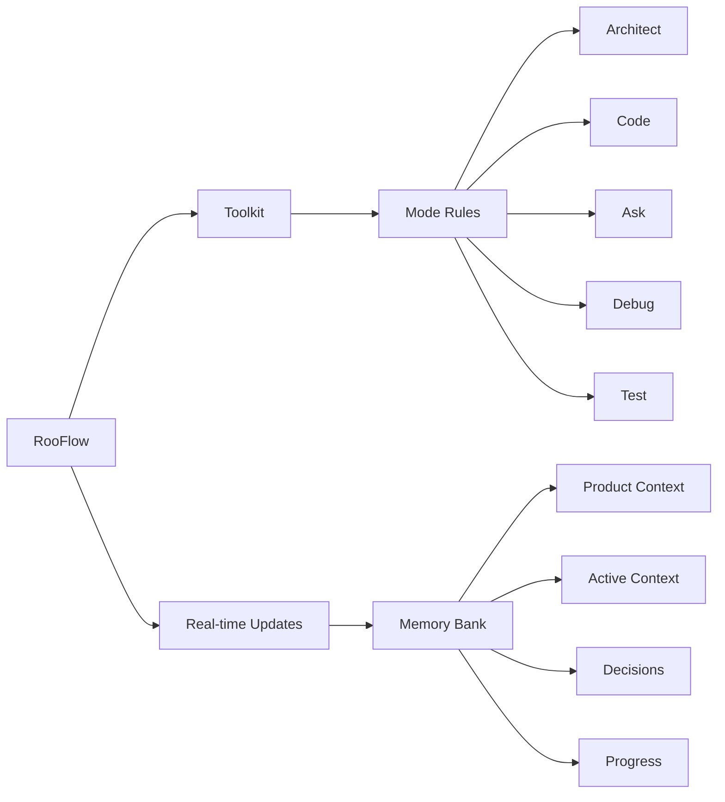

<div style="max-width: 800px; margin-left: auto; margin-right: auto; text-align: left;">

##### For those who wish to create other modes, I've added a [modules](https://github.com/GreatScottyMac/RooFlow/tree/main/modules) directory, containing the components of the RooFlow system prompts. Basically you would need to modify [modes.yml](https://github.com/GreatScottyMac/RooFlow/blob/main/modules/modes.yml) so that your new mode will interact correctly with the other modes. Then replace that section of [rooflow_core_prompt.yaml](https://github.com/GreatScottyMac/RooFlow/blob/main/modules/rooflow_core_prompt.yaml) and add the [memory_bank_strategy.yml](https://github.com/GreatScottyMac/RooFlow/blob/main/modules/memory_bank_strategy.yml) to the end of your `system-prompt-[mode]` file. You'll also need to add an entry to the [.roomodes](https://github.com/GreatScottyMac/RooFlow/blob/main/config/.roomodes) file. 

##### Now with install scripts for [Windows](https://raw.githubusercontent.com/GreatScottyMac/RooFlow/main/config/install_rooflow.cmd) and [Linux/macOS](https://raw.githubusercontent.com/GreatScottyMac/RooFlow/main/config/install_rooflow.sh)!

##### [Default Mode](https://github.com/GreatScottyMac/RooFlow#install-global-default-and-boomerang-modes) and [Boomerang Mode](https://github.com/GreatScottyMac/RooFlow#install-global-default-and-boomerang-modes) are available for manual installation.

##### For MCP server use in RooFlow custom modes, there is a `MCP_SERVERS_PLACEHOLDER` in the `system-prompt-[mode]` files where connected MCP servers will need to be inserted.
</div>

<div align="center">

<br>
  
### ☢️☢️☢️ Footgun in Use ☢️☢️☢️

<br>

# RooFlow 


**Persistent Project Context and Streamlined AI-Assisted Development**

[](https://github.com/RooVetGit/Roo-Code)
[](https://github.com/GreatScottyMac/RooFlow)

</div>

## 🎯 Overview

RooFlow enhances AI-assisted development in VS Code by providing **persistent project context** and **optimized mode interactions**, resulting in **reduced token consumption** and a more efficient workflow.  It builds upon the concepts of the Roo Code Memory Bank, but streamlines the process and introduces a more integrated system of modes. RooFlow ensures your AI assistant maintains a deep understanding of your project across sessions, even after interruptions.

### Key Improvements over Roo Code Memory Bank:

*   **Reduced Token Consumption:** Optimized prompts and instructions minimize token usage.
*   **Five Integrated Modes:**  Architect, Code, Test, Debug, and Ask modes work together seamlessly.
*   **Simplified Setup:**  Easier installation and configuration.
*   **Streamlined Real-time Updates:**  More efficient and targeted Memory Bank updates.
*   **Clearer Instructions:**  Improved YAML-based rule files for better readability and maintainability.

### Key Components



- 🧠 **Memory Bank**: Persistent storage for project knowledge (automatically managed).
- 💻 **System Prompts**: YAML-based core instructions for each mode (`.roo/system-prompt-[mode]`).
- 🔧 **VS Code Integration**: Seamless development experience within VS Code.
- ⚡ **Real-time Updates**:  Automatic Memory Bank updates triggered by significant events.

## 🚀 Quick Start

   ### Installation

   1.  **Install Roo Code Extension:** Ensure you have the [Roo Code extension](https://github.com/RooVetGit/Roo-Code) installed in VS Code.
   2.  **Prerequisite: Install Git:** The installation script requires `git` to be installed and accessible in your system's PATH. Download Git from [https://git-scm.com/downloads](https://git-scm.com/downloads).

   3.  **Open your terminal** and navigate (`cd`) to your project's **root directory**.
   4.  **Run the appropriate command** for your operating system directly:
       *   **Windows (Command Prompt or PowerShell):**
           1. Download the script:
              ```cmd
              curl -L -o install_rooflow.cmd https://raw.githubusercontent.com/GreatScottyMac/RooFlow/main/config/install_rooflow.cmd
              ```
           2. Execute the downloaded script:
              ```cmd
              .\install_rooflow.cmd
              ```
       *   **Linux / macOS (bash/zsh):**
           1. Download the script:
              ```bash
              curl -L -o install_rooflow.sh https://raw.githubusercontent.com/GreatScottyMac/RooFlow/main/config/install_rooflow.sh
              ```
           2. Make the script executable:
              ```bash
              chmod +x install_rooflow.sh
              ```
           3. Execute the downloaded script:
              ```bash
              ./install_rooflow.sh
              ```
   5.  The command downloads and executes the script, which will check for `git`, clone the repository, move files, clean up, and run the variable insertion process. Follow any on-screen prompts or error messages.
   6.  **Note:** Upon successful completion, the downloaded scripts (`install_rooflow.*` and `insert-variables.*`) will be automatically removed.

   4.  **Verify Installation:** After the script runs successfully:
       *   Check that the `.roo/` directory, along with the `.roomodes`file exist in your project root.
       *   Optionally, inspect the `.roo/system-prompt-*` files to ensure placeholders like `WORKSPACE_PLACEHOLDER` have been replaced with your actual system paths.

   ### Install Global Default and Boomerang Modes

   Since the Default and Boomerang modes both use the default Roo Code system prompt, you may wish to make these modes global. If so, follow these manual steps using the Roo Code UI:

   1.  **Open Roo Code Settings:** Click the Roo Code icon in the VS Code Activity Bar, then click the "Prompts" icon (looks like a book/document - Step 1 in image below).
    <br> 
    

   2.  **Add New Mode:** Scroll down to the "Modes" section and click the "+" icon (Step 2)

   3.  **Enter Name:** In the "Create New Mode" view, enter the mode name (`Default` or `Boomerang`) in the "Name" field (Step 3).
    <br> <!-- Optional: Add a line break for spacing -->
    

   4.  **Slug:** The "Slug" field should automatically populate with `default` or `boomerang` (Step 4).

   5.  **Save Location:** Select "Global" (Step 5).

   6.  **Role Definition:** Copy the text below and paste it into the "Role Definition" text box (Step 6).

   For Default mode:
 ```text      
A custom, global mode in Roo Code, using the Roo Code default rules and instructions, along with the custom instruction set for memory bank functionality. Typically called upon when a functionality is not working correctly with the other custom modes. You should have a very broad range of knowledge and abilities.
```
For Boomerang mode:
```text
You are Roo, a strategic workflow orchestrator who coordinates complex tasks by delegating them to appropriate specialized modes. You have a comprehensive understanding of each mode's capabilities and limitations, allowing you to effectively break down complex problems into discrete tasks that can be solved by different specialists.
```
<br>

   7.  **Custom Instructions:** Copy the custom instructions for the relevant mode, provided below, and paste it into the "Custom Instructions" text box (Step 7).
