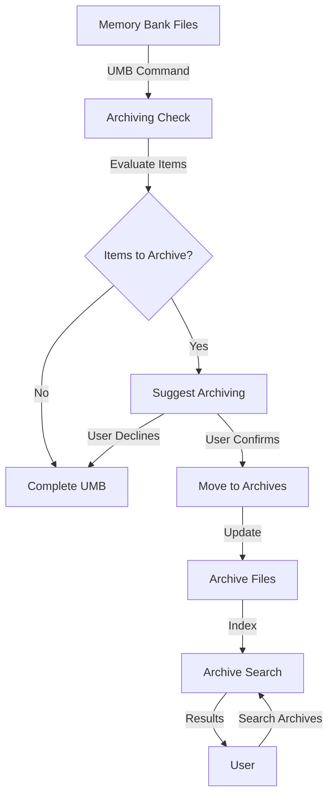
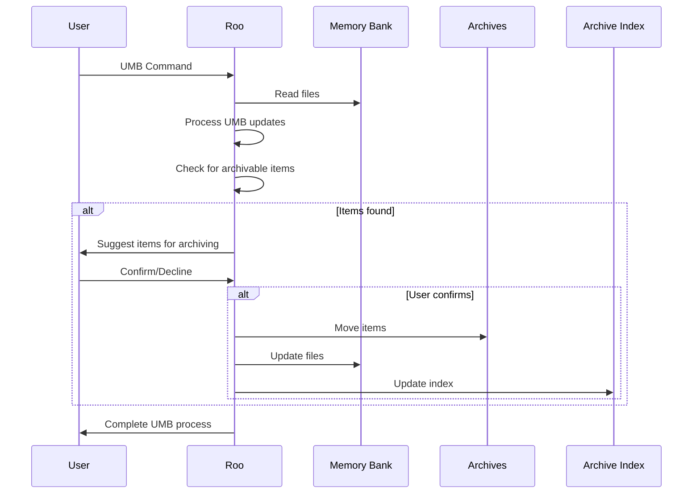
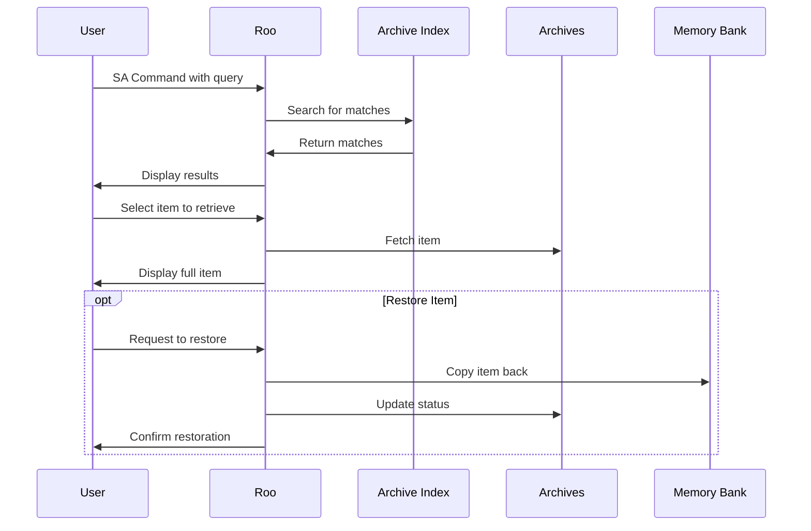

# Memory Bank Archiving System: Detailed Plan

This document outlines the plan for implementing a memory bank archiving system that will help streamline Roo by selectively archiving items that are complete or no longer necessary for loading into context.

## 1. Overview

The system will:
- Tag items in memory bank files with status indicators
- Use different criteria for each file type to determine archiving eligibility
- Automatically check for archivable items during UMB (Update Memory Bank) operations
- Suggest items for archiving but require user confirmation
- Move confirmed items to dedicated archive files
- Provide search functionality to retrieve archived items when needed

## 2. Architecture



## 3. File Structure

```
memory-bank/
├── activeContext.md
├── decisionLog.md
├── productContext.md
├── progress.md
├── systemPatterns.md
└── archives/
    ├── activeContext-archive.md
    ├── decisionLog-archive.md
    ├── productContext-archive.md
    ├── progress-archive.md
    ├── systemPatterns-archive.md
    └── archive-index.md
```

## 4. Tagging System

We'll implement a consistent tagging system across all memory bank files:

- `#active` - Currently relevant items
- `#completed` - Items that have been completed but might still be relevant
- `#obsolete` - Items that are no longer relevant
- `#archived` - Items that have been moved to archive files

## 5. File-Specific Archiving Criteria

### 5.1 activeContext.md
- **Archivable when**: 
  - Open questions/issues marked as `#completed` or `#obsolete`
  - Recent changes older than 30 days and not referenced in recent tasks
  - Current focus items that have been superseded by newer focus areas

### 5.2 decisionLog.md
- **Archivable when**:
  - Decisions that have been superseded by newer decisions (marked `#obsolete`)
  - Decisions related to completed features/components (marked `#completed`)
  - Decisions older than 60 days that don't impact current development

### 5.3 progress.md
- **Archivable when**:
  - Completed milestones/tasks (marked `#completed`)
  - Progress entries older than 30 days
  - Entries related to features/components that are no longer being actively developed

### 5.4 productContext.md
- **Archivable when**:
  - Features that have been fully implemented and are stable (marked `#completed`)
  - Goals that have been achieved (marked `#completed`)
  - Architectural elements that have been replaced or significantly modified (marked `#obsolete`)

### 5.5 systemPatterns.md
- **Archivable when**:
  - Design patterns no longer in use (marked `#obsolete`)
  - Coding standards that have been updated/replaced (marked `#obsolete`)
  - Architectural patterns that are no longer relevant to the current system

## 6. Archiving Process

### 6.1 Automatic Check During UMB


### 6.2 Archive File Format
Each archive file will maintain the same structure as its source file, with additional metadata:
- Original file source
- Date archived
- Reason for archiving
- Tags

### 6.3 Archive Index
The `archive-index.md` file will serve as a searchable index of all archived items, containing:
- Brief description of each archived item
- Original file source
- Date archived
- Keywords for searching
- Link to the specific section in the archive file

## 7. Search and Retrieval

### 7.1 Search Command
Implement a new "Search Archives" (SA) command that allows users to:
- Search by keywords
- Filter by original file type
- Filter by date range
- Filter by tags

### 7.2 Retrieval Process


## 8. Implementation Steps

1. **Create Archive Directory Structure**
   - Create `memory-bank/archives/` directory
   - Initialize archive files for each memory bank file
   - Create `archive-index.md`

2. **Update Memory Bank File Format**
   - Modify existing files to support tagging
   - Add status indicators to existing entries
   - Update documentation to explain the tagging system

3. **Implement Archiving Logic**
   - Develop file-specific criteria evaluation
   - Create archiving suggestion mechanism
   - Implement confirmation workflow
   - Build archive movement functionality

4. **Enhance UMB Command**
   - Add archiving check to UMB process
   - Implement user confirmation dialog
   - Update UMB documentation

5. **Create Search Functionality**
   - Implement SA command
   - Develop search algorithms
   - Create result display format
   - Build item retrieval mechanism

6. **Update Documentation**
   - Add archiving system documentation
   - Update existing memory bank documentation
   - Create user guides for the new commands

## 9. Custom Mode Updates

Update the custom mode definitions to include:
- Awareness of the archiving system
- Ability to suggest items for archiving
- Support for the SA command
- Logic to handle archived vs. active content

## 10. Testing Plan

1. **Unit Testing**
   - Test tagging functionality
   - Test archiving criteria for each file type
   - Test archive file creation and updating

2. **Integration Testing**
   - Test UMB with archiving suggestions
   - Test search and retrieval functionality
   - Test restoration of archived items

3. **User Acceptance Testing**
   - Test with real project data
   - Verify archiving suggestions are relevant
   - Confirm search results are accurate