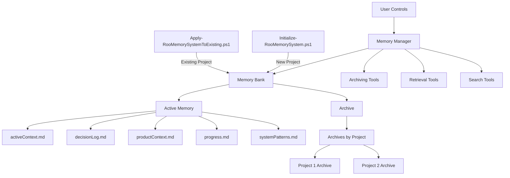
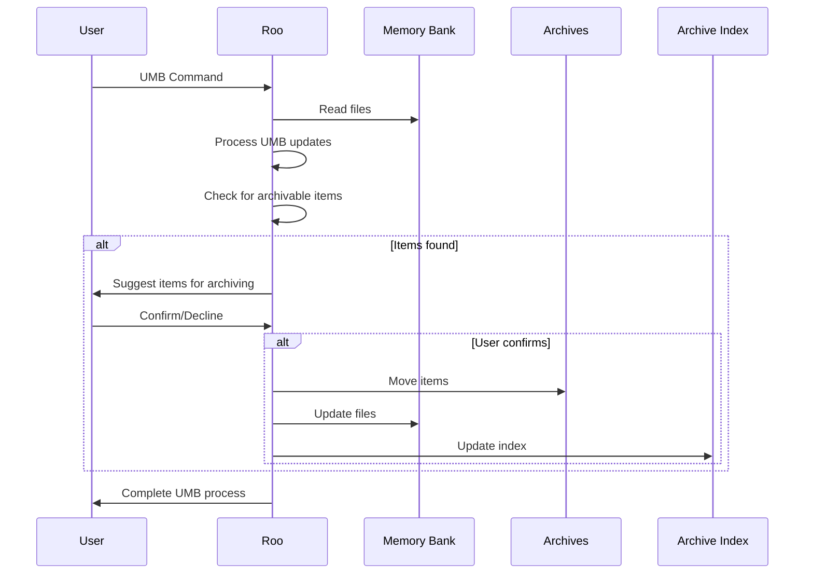
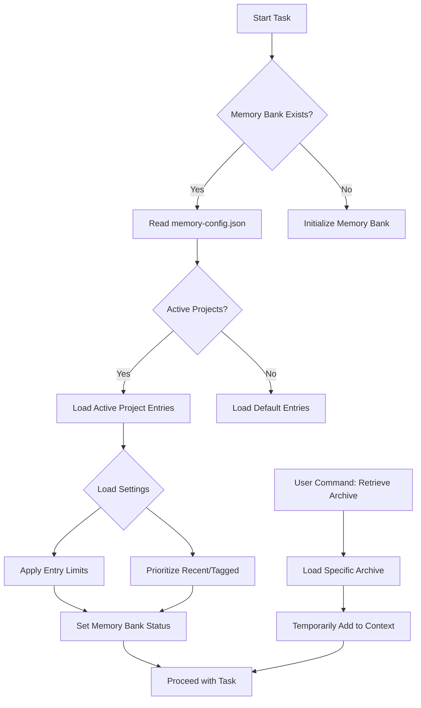
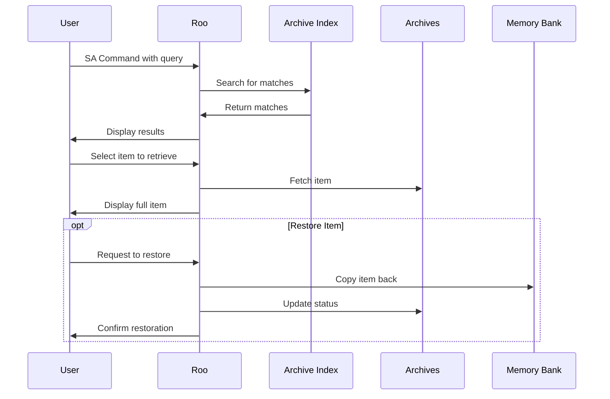

# Memory Bank Optimization and Archiving System: Combined Plan

This document outlines a combined plan for implementing a memory bank optimization and archiving system that will help streamline Roo by selectively archiving items that are complete or no longer necessary for loading into context, ultimately saving token costs.

## 1. Overview

The system will:

*   Tag items in memory bank files with status indicators.
*   Use different criteria for each file type to determine archiving eligibility.
*   Automatically check for archivable items during UMB (Update Memory Bank) operations.
*   Suggest items for archiving but require user confirmation.
*   Move confirmed items to dedicated archive files.
*   Provide search functionality to retrieve archived items when needed.
*   Implement relevance-based memory bank system.
*   Implement selective loading of the most relevant information at the start of each task.
*   Implement cross-repository search across both active and archived content.
*   Provide PowerShell scripts for easy integration into new and existing projects.

## 2. Architecture



## 3. File Structure

```
project-root/
├── .roo/
│   └── [system prompt files]
├── memory-bank/
│   ├── activeContext.md
│   ├── decisionLog.md
│   ├── productContext.md
│   ├── progress.md
│   ├── systemPatterns.md
│   ├── memory-config.json
│   └── archives/
│       ├── activeContext-archive.md
│       ├── decisionLog-archive.md
│       ├── productContext-archive.md
│       ├── progress-archive.md
│       ├── systemPatterns-archive.md
│       └── archive-index.md
├── memory-archives/
│   ├── [Project1]/
│   │   ├── archived-context-[timestamp].md
│   │   ├── archived-decisions-[timestamp].md
│   │   └── archived-progress-[timestamp].md
│   └── [Project2]/
│       └── [archived files]
├── scripts/  # New directory for integration scripts
│   ├── Initialize-RooMemorySystem.ps1
│   └── Apply-RooMemorySystemToExisting.ps1
└── memory-manager.ps1 # Assuming Memory Manager is a script
```

## 4. Tagging System

We'll implement a consistent tagging system across all memory bank files:

*   `<!-- @active -->` - Currently relevant items
*   `<!-- @completed -->` - Items that have been completed but might still be relevant
*   `<!-- @obsolete -->` - Items that are no longer relevant
*   `<!-- @archived -->` - Items that have been moved to archive files
*   `<!-- @project:ProjectName -->` - Project association

Example:

```markdown
<!-- @active -->
[2025-03-20 14:30:00] - Working on feature X implementation
<!-- @end -->

<!-- @project:ProjectName -->
[2025-03-15 10:15:00] - Decision to use React for the frontend
<!-- @end -->

<!-- @completed -->
[2025-03-10 09:00:00] - Completed initial setup of project structure
<!-- @end -->
```

## 5. File-Specific Archiving Criteria

### 5.1 activeContext.md

*   **Archivable when**:
    *   Open questions/issues marked as `#completed` or `#obsolete`
    *   Recent changes older than 30 days and not referenced in recent tasks
    *   Current focus items that have been superseded by newer focus areas

### 5.2 decisionLog.md

*   **Archivable when**:
    *   Decisions that have been superseded by newer decisions (marked `#obsolete`)
    *   Decisions related to completed features/components (marked `#completed`)
    *   Decisions older than 60 days that don't impact current development

### 5.3 progress.md

*   **Archivable when**:
    *   Completed milestones/tasks (marked `#completed`)
    *   Progress entries older than 30 days
    *   Entries related to features/components that are no longer being actively developed

### 5.4 productContext.md

*   **Archivable when**:
    *   Features that have been fully implemented and are stable (marked `#completed`)
    *   Goals that have been achieved (marked `#completed`)
    *   Architectural elements that have been replaced or significantly modified (marked `#obsolete`)

### 5.5 systemPatterns.md

*   **Archivable when**:
    *   Design patterns no longer in use (marked `#obsolete`)
    *   Coding standards that have been updated/replaced (marked `#obsolete`)
    *   Architectural patterns that are no longer relevant to the current system

## 6. Archiving Process

### 6.1 Automatic Check During UMB



### 6.2 Archive File Format

Each archive file will maintain the same structure as its source file, with additional metadata:

*   Original file source
*   Date archived
*   Reason for archiving
*   Tags

### 6.3 Archive Index

The `archive-index.md` file will serve as a searchable index of all archived items, containing:

*   Brief description of each archived item
*   Original file source
*   Date archived
*   Keywords for searching
*   Link to the specific section in the archive file

## 7. Memory Configuration File (memory-config.json)

```json
{
  "activeProjects": ["ProjectA", "ProjectB"],
  "completedProjects": ["ProjectC"],
  "archiveSettings": {
    "autoArchiveCompleted": true,
    "keepCompletedDays": 14,
    "archiveOnUMB": true
  },
  "loadSettings": {
    "prioritizeActive": true,
    "maxEntriesPerFile": 50,
    "loadCompletedProjects": false
  },
  "projectMetadata": {
    "ProjectA": {
      "status": "active",
      "lastActivity": "2025-03-25T14:30:00Z"
    },
    "ProjectB": {
      "status": "active",
      "lastActivity": "2025-03-24T10:15:00Z"
    },
    "ProjectC": {
      "status": "completed",
      "completionDate": "2025-03-10T09:00:00Z",
      "archived": true,
      "archivePath": "memory-archives/ProjectC/"
    }
  }
}
```

## 8. Memory Manager Commands

1.  **Archive Project**: Move completed project information to archives

    ```
    Archive Project [ProjectName]
    ```
2.  **Mark Project Complete**: Tag a project as completed (ready for archiving)

    ```
    Mark Project Complete [ProjectName]
    ```
3.  **Mark Project Active**: Change a project's status to active

    ```
    Mark Project Active [ProjectName]
    ```
4.  **Retrieve Archive**: Load archived information for a specific project

    ```
    Retrieve Archive [ProjectName]
    ```
5.  **Optimize Memory Bank**: Clean up and optimize the current memory bank

    ```
    Optimize Memory Bank
    ```

## 9. Memory Bank Loading Process



## 10. Search and Retrieval

### 10.1 Search Command

Implement a new "Search Archives" (SA) command that allows users to:

*   Search by keywords
*   Filter by original file type
*   Filter by date range
*   Filter by tags

### 10.2 Retrieval Process



## 11. PowerShell Integration Scripts

### 11.1 `Initialize-RooMemorySystem.ps1`

*   **Purpose**: Sets up the memory bank optimization and archiving system in a **new** project directory.
*   **Actions**:
    *   Creates the `memory-bank/archives/` directory.
    *   Creates the `memory-archives/` directory.
    *   Creates the `memory-config.json` file with default settings.
    *   Initializes empty archive files (`activeContext-archive.md`, etc.) within `memory-bank/archives/`.
    *   Initializes an empty `archive-index.md`.
    *   Optionally copies the `memory-manager.ps1` script (if it's a standalone tool).
*   **Usage**: `.\scripts\Initialize-RooMemorySystem.ps1 -ProjectPath "C:\path\to\new\project"`

### 11.2 `Apply-RooMemorySystemToExisting.ps1`

*   **Purpose**: Applies the memory bank optimization and archiving system to an **existing** project with a potentially populated memory bank.
*   **Actions**:
    *   Checks for and creates `memory-bank/archives/` and `memory-archives/` if they don't exist.
    *   Checks for and creates `memory-config.json` with default settings if it doesn't exist.
    *   Checks for and creates empty archive files and `archive-index.md` if they don't exist.
    *   **Integrates with Migration Tools**:
        *   Runs an analysis of the existing memory bank files (similar to `Migrate Memory Bank --analyze-only`).
        *   Prompts the user to confirm the proposed project structure and tagging (similar to `Migrate Memory Bank --interactive`).
        *   Applies retroactive tagging to existing entries based on user confirmation.
        *   Optionally moves identified "completed" or "obsolete" items to the archive based on initial analysis and user confirmation.
*   **Usage**: `.\scripts\Apply-RooMemorySystemToExisting.ps1 -ProjectPath "C:\path\to\existing\project"`

## 12. Implementation Steps

1.  **Create Core Directory Structure & Files**
    *   Define the structure (`memory-bank/archives/`, `memory-archives/`).
    *   Define the format for `memory-config.json`, archive files, and `archive-index.md`.
2.  **Develop PowerShell Integration Scripts**
    *   Create `Initialize-RooMemorySystem.ps1`.
    *   Create `Apply-RooMemorySystemToExisting.ps1` (initial version focusing on structure setup).
3.  **Update Memory Bank File Format & Tagging**
    *   Modify existing files/processes to support tagging (`<!-- @tag -->`).
    *   Update documentation for the tagging system.
4.  **Implement Archiving Logic**
    *   Develop file-specific criteria evaluation logic.
    *   Create the archiving suggestion mechanism (during UMB).
    *   Implement the user confirmation workflow.
    *   Build the functionality to move items to archive files and update the index.
5.  **Enhance UMB Command**
    *   Integrate the archiving check and suggestion flow into the UMB process.
6.  **Create Search Functionality**
    *   Implement the "Search Archives" (SA) command.
    *   Develop search algorithms (index-based).
    *   Create result display and item retrieval/restore mechanisms.
7.  **Implement Memory Manager Script/Tool**
    *   Create the `memory-manager.ps1` (or integrate commands elsewhere).
    *   Implement commands: `Archive Project`, `Mark Project Complete/Active`, `Retrieve Archive`, `Optimize Memory Bank`.
8.  **Update Loading Process**
    *   Modify memory bank initialization to read `memory-config.json` and perform selective loading based on settings.
    *   Implement the `Retrieve Archive` command's effect on the loading process.
9.  **Build Migration Tools & Enhance `Apply-RooMemorySystemToExisting.ps1`**
    *   Build the analysis tool for existing memory banks.
    *   Create the retroactive tagging system (interactive).
    *   Implement the core migration logic (`Migrate Memory Bank` command functionality).
    *   Integrate these tools fully into `Apply-RooMemorySystemToExisting.ps1`.
10. **Update Documentation**
    *   Document the full system, including PowerShell scripts and migration.
    *   Create user guides.
11. **Custom Mode Updates**
    *   Update mode definitions for awareness and interaction with the new system.
12. **Testing Plan**
    *   **Unit Testing**: Test tagging, criteria, archiving logic, script actions.
    *   **Integration Testing**: Test UMB flow, SA command, Memory Manager commands, loading process, full script runs (new and existing projects).
    *   **User Acceptance Testing**: Test with real project data, verify suggestions, confirm search accuracy, test migration on diverse projects.

## 13. Saving Token Cost

*   By implementing selective loading, only the most relevant information will be loaded into the context, reducing token consumption.
*   By archiving obsolete or completed items, the size of the active memory bank will be reduced, further reducing token consumption.
*   By implementing a tiered search system, users can start with a default search that only searches the active memory bank, and then expand the search to include archives if necessary. This will help to minimize token consumption for most searches.