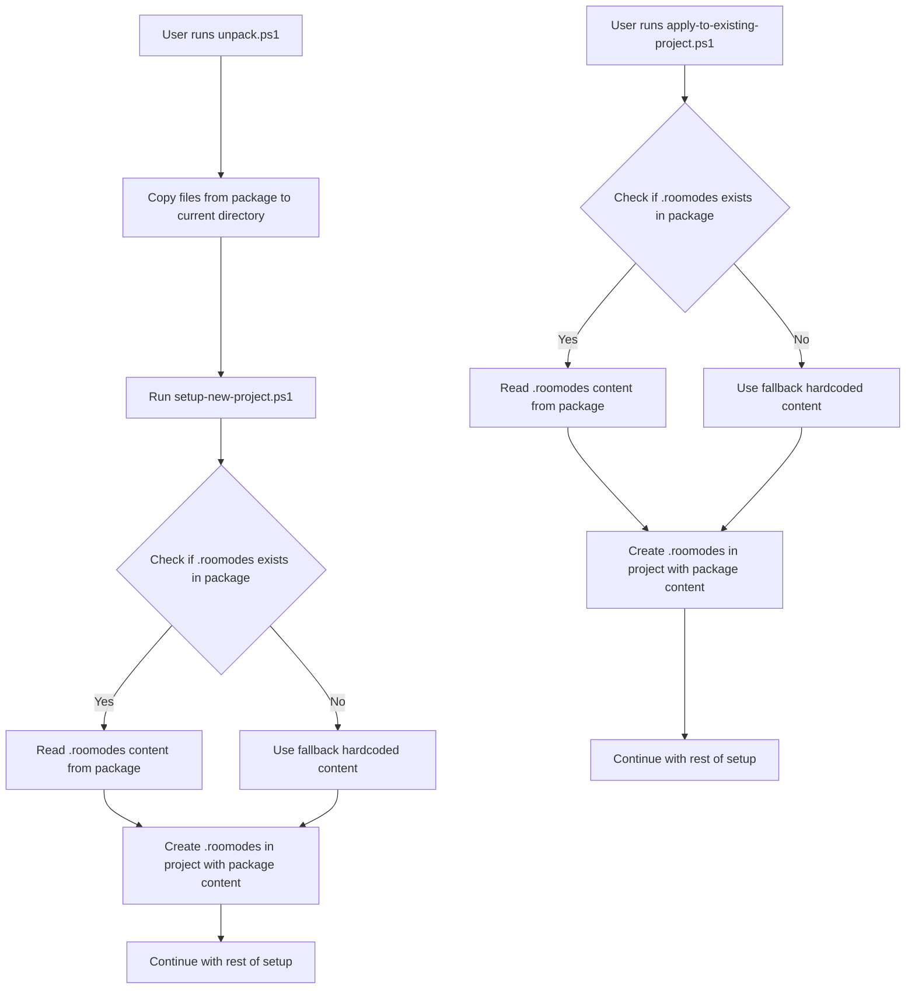

# RooModes Implementation Plan

## Overview

This plan outlines the steps to modify the RooFlow package scripts to use a pre-loaded `.roomodes` file instead of hardcoded content.

## Current State

Currently, both the `setup-new-project.ps1` and `apply-to-existing-project.ps1` scripts create a `.roomodes` file with hardcoded content. We want to modify these scripts to use the custom `.roomodes` file from the root directory that contains multiple custom modes (qa-engineer, product-manager, uiux-designer, etc.).

## Implementation Steps

1. **Copy the `.roomodes` file to the `roo_package` directory**
   - This will make it part of the package that gets distributed

2. **Modify the `setup-new-project.ps1` script**
   - Replace the hardcoded `.roomodes` content (lines 42-65) with code that:
     - Looks for the `.roomodes` file in the package directory
     - Reads its content
     - Creates a new `.roomodes` file in the target project with this content
   - Add fallback to the original hardcoded content if the file doesn't exist

3. **Modify the `apply-to-existing-project.ps1` script**
   - Replace the hardcoded `.roomodes` content (lines 17-36) with code that:
     - Looks for the `.roomodes` file in the package directory
     - Reads its content
     - Creates a new `.roomodes` file in the target project with this content
   - Add fallback to the original hardcoded content if the file doesn't exist

4. **Update the `unpack.ps1` script**
   - Ensure it correctly copies the `.roomodes` file from the package to the appropriate location

## Process Flow



## Code Changes

### For `setup-new-project.ps1`:

```powershell
# Step 2: Create .roomodes file
Write-Host "Creating .roomodes file..." -ForegroundColor Yellow

# Path to the package .roomodes file
$packageRoomodesPath = Join-Path -Path $scriptDir -ChildPath "../.roomodes"

# Check if the package .roomodes file exists
if (Test-Path -Path $packageRoomodesPath) {
    # Read content from the package .roomodes file
    $roomodesContent = Get-Content -Path $packageRoomodesPath -Raw
    Write-Host "Using .roomodes content from package" -ForegroundColor Green
} else {
    # Fallback to hardcoded content
    $roomodesContent = @'
    {
      "customModes": [
        {
          "slug": "test",
          "name": "Test",
          "roleDefinition": "You are Roo's Test mode for this specific project",
          "groups": [
            "read",
            "browser",
            "command",
            "edit",
            "mcp"
          ],
          "source": "project",
          "customInstructions": "Always check to make sure memory bank is active. Explicitly prompt Emily when she needs to do a manual action. terminal commands must be PowerShell. Explicitly prompt Emily when she needs to do a manual action. Save to memory and prompt user to start a new task when token cost nears $0.5"
        }
      ]
    }
'@
    Write-Host "Using default .roomodes content (package file not found)" -ForegroundColor Yellow
}

# Write the content to the .roomodes file
Set-Content -Path ".roomodes" -Value $roomodesContent
Write-Host "Created .roomodes file" -ForegroundColor Green
```

### For `apply-to-existing-project.ps1`:

```powershell
# Step 1: Create .roomodes file if it doesn't exist
if (-not (Test-Path -Path ".roomodes")) {
    Write-Host "Creating .roomodes file..." -ForegroundColor Yellow
    
    # Path to the package .roomodes file
    $packageRoomodesPath = Join-Path -Path (Split-Path -Parent $PSCommandPath) -ChildPath "../.roomodes"
    
    # Check if the package .roomodes file exists
    if (Test-Path -Path $packageRoomodesPath) {
        # Read content from the package .roomodes file
        $roomodesContent = Get-Content -Path $packageRoomodesPath -Raw
        Write-Host "Using .roomodes content from package" -ForegroundColor Green
    } else {
        # Fallback to hardcoded content
        $roomodesContent = @'
{
  "customModes": [
    {
      "slug": "test",
      "name": "Test",
      "roleDefinition": "You are Roo's Test mode for this specific project",
      "groups": [
        "read",
        "browser",
        "command",
        "edit",
        "mcp"
      ],
      "source": "project",
      "customInstructions": "Always check to make sure memory bank is active. Explicitly prompt Emily when she needs to do a manual action. terminal commands must be PowerShell. Explicitly prompt Emily when she needs to do a manual action. Save to memory and prompt user to start a new task when token cost nears $0.5"
    }
  ]
}
'@
        Write-Host "Using default .roomodes content (package file not found)" -ForegroundColor Yellow
    }
    
    Set-Content -Path ".roomodes" -Value $roomodesContent
    Write-Host "Created .roomodes file" -ForegroundColor Green
} else {
    Write-Host ".roomodes file already exists" -ForegroundColor Yellow
}
```

### For `unpack.ps1`:

```powershell
# Copy .roomodes file if it exists
$packageRoomodesPath = Join-Path -Path $packageDir -ChildPath ".roomodes"
$targetRoomodesPath = Join-Path -Path $currentDir -ChildPath ".roomodes"

if (Test-Path -Path $packageRoomodesPath) {
    Copy-Item -Path $packageRoomodesPath -Destination $targetRoomodesPath -Force
    Write-Host "Copied .roomodes file" -ForegroundColor Green
}